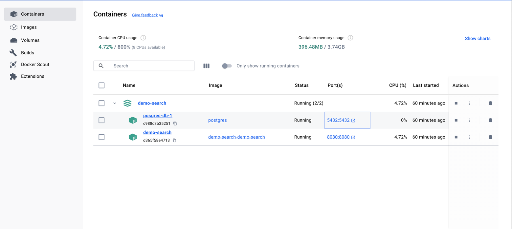

# Customer Search 

The customer search application is built by React and Microservices.
The backend of this project is a Spring Boot application that provides a Restful API for searching customers by their first name, last name or company.
It uses PostgreSQL as the database and is containerized using Docker.
The frontend is built with React + Vite to provide a user interface for searching customers. Frontend README is [here](frontend%2FREADME.MD) 

## Table of Content

* [Prerequisites](#Prerequisites)
* [Features](#Features)
* [Why SpringBoot](#Why-SpringBoot)
* [Getting Started](#Getting-Started)
* [Build the application](#Build-the-Application)
* [Run the application](#Run-The-Application)
* [Usage](#Usage)
* [Built With](#Built-With)
* [Running the Frontend](#Running-the-Frontend)
* [Communication Flow](#Communication-Flow)

## Features

- Customer search by firstName, lastName, and companyName.
- RESTful API endpoints for managing and searching customers.
- Pagination support for search results.
- OpenAPI yaml - customer.yaml defines the contract between front end and back end service.
- Logging with Log4j2.
- Integration with PostgreSQL as data store.
- Dockerized for easy deployment.

## Prerequisites

- Java 17
- SpringBoot 3.3
- Maven 3.6.3 or higher
- Postgresql
- Docker

## Why SpringBoot

- Rapid Development: Spring Boot simplifies the development process by providing pre-configured setups for various
  functionalities. This allows developers to focus more on writing business logic rather than configuring the framework
- Microservices Ready: Spring Boot is designed to support microservices architecture. It offers out-of-the-box support
  for developing and deploying microservices, making it easier to build scalable and distributed systems.
  Integration with Modern DevOps Tools: Spring Boot integrates well with modern DevOps tools and practices, such as
  Docker and Kubernetes. This makes it suitable for containerized applications and continuous delivery pipelines.
- Comprehensive Ecosystem: The Spring ecosystem provides a wide range of modules and tools for various needs, such as
  Spring Data for data access, Spring Security for authentication and authorization, and Spring Cloud for cloud-native
  development

## Getting Started

### Clone the Repository

```sh
git clone https://github.com/fangz003/search-spring-boot.git
```

## Build the Application

```sh
mvn clean install
```

## Run the application

### Build and start the service in docker container.

```sh
docker-compose build
docker-compose up -d
```

It will take a couple of minutes to start the application in the container for the first time, due to docker needs to
pull postgres image and build the demo-search application image.
After docker is up and running, the container has status as Running


### Stop the service in docker container.

```sh
docker-compose down
```

### Run application by maven plugin. This can be used when docker is not available.

```sh
mvn spring-boot:run
```

## Usage

Search Customers by First Name
Endpoint: /demo/customers/searchByFirstName
Method: GET
Parameters:
firstName (query parameter, required): The first name of the customer to search for.

Example Request:

```sh
curl -X GET "http://localhost:8080/demo/customers/searchByFirstName?firstName=John"
```

### Example Response:

```json
[
  {
    "id": 1,
    "firstName": "John",
    "lastName": "Doe",
    "companyName": "Company A"
  },
  {
    "id": 2,
    "firstName": "John",
    "lastName": "Smith",
    "companyName": "Company B"
  }
]
```

## Run Tests

Run the backend unit tests using the following command

```sh
mvn test
```

## Built With

    - Spring Boot - Backend framework
    - React - Frontend library
    - Docker - Containerization
    - PostgreSQL - Database
    - Maven - Dependency management
    - JaCoCo - Code coverage

## Backend Configuration

### Spring boot application configuration

```
spring:
  main:
    allow-bean-definition-overriding: true
  application:
    name: demo-search
  datasource:
    url: jdbc:postgresql://localhost:5432/demodb
    username: user
    password: pass
    driver-class-name: org.postgresql.Driver
  jpa:
    hibernate:
      ddl-auto: update
    show-sql: true
    database-platform: org.hibernate.dialect.PostgreSQLDialect

logging:
  config: classpath:log4j2.xml
  level:
    root: INFO
    com.demo.search: DEBUG

server:
  port:
  servlet:
    context-path: /demo
  error:
    whitelabel:
      enabled: true
    include-stacktrace: always
```

### Docker compose configuration

```
version: '3.1'

services:
posgres-db:
image: postgres
restart: always
environment:
POSTGRES_USER: user
POSTGRES_PASSWORD: pass
POSTGRES_DB: demodb
ports:
- "5432:5432"

demo-search:
build: .
container_name: demo-search
ports:
- "8080:8080"
environment:
SPRING_DATASOURCE_URL: jdbc:postgresql://posgres-db:5432/demodb
SPRING_DATASOURCE_USERNAME: user
SPRING_DATASOURCE_PASSWORD: pass
depends_on: posgres-db

volumes:
postgres-data:
```

## Communication Flow
- User Interaction: The user interacts with the React frontend by entering a first name in the search form and submitting it.
- Frontend Request: The React component makes an HTTP GET request to the Spring Boot backend API endpoint.
- Backend Processing: The Spring Boot controller handles the request, invokes the service layer for business logic, and interacts with the repository to fetch data from the PostgreSQL database.
- Database Query: The repository executes a query to find customers matching the search criteria.
- Response: The backend returns the search results to the frontend in JSON format.
- Display Results: The React component receives the response and updates the UI to display the list of customers.