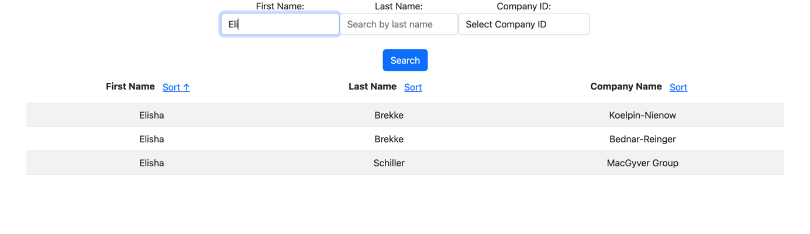
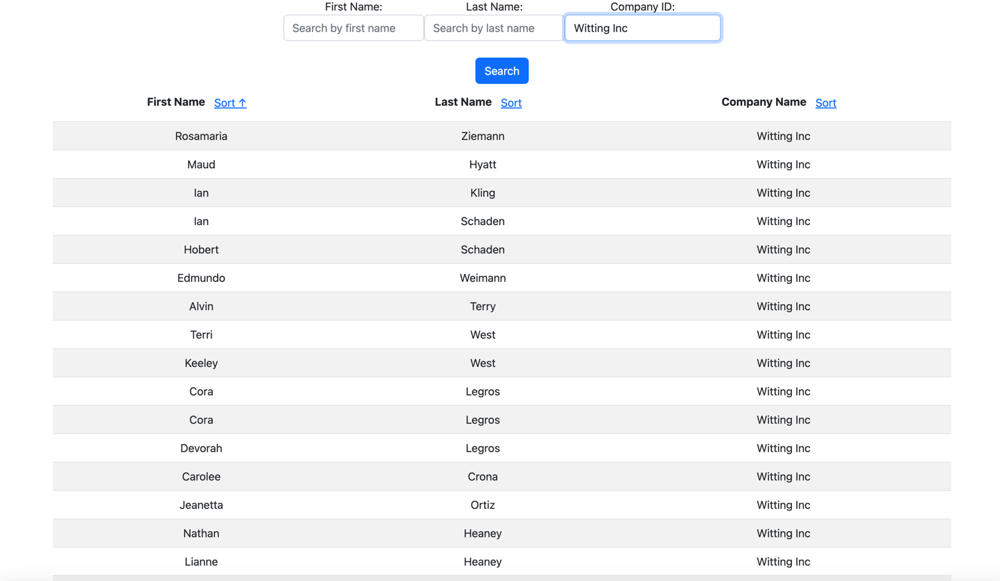
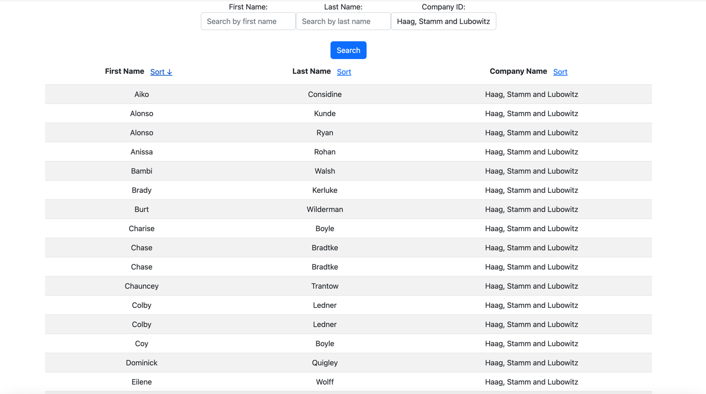

# Customer Search

## Description 
This react application provides a user interface to search, filter, and sort customer data. The search term, filter selection, and sort options are persisted in the URL as query parameters, allowing for easy sharing and retrieval of search results.

## Features

### Search (A)
As you type text in the input field, the system displays a list of customers whose first name or last name matches the text entered.
The search text is persisted in the URL as a query parameter. You can copy and paste the URL into another browser window to receive the same filter results.
Example URL: http://localhost:5173/demo/customers/search/searchByFirstName?firstName=Erin



### Filter (B)
When you select a company name from the dropdown, the system displays a list of customers whose company name matches the dropdown selection.
The company name is persisted in the URL as a query parameter. You can copy and paste the URL into another browser window to receive the same filter results.
Example URL: http://localhost:5173/customers/search/searchByCompanyId?companyId=1



### Sort (C)
When you select a 'Sort by' option, the data returned to the UI has already been sorted by the backend.
The system displays the sorted results in the UI.
The sort option is persisted in the URL as a query parameter. You can copy and paste the URL into another browser window to receive the same filter results.
Example URL: http://localhost:5173/customers/search/searchByCompanyId?companyId=1&sortDirection=asc&sortField=firstName



## Installation Instructions
### Prerequisites
- Node.js
- npm
- React
- bootstrap css
- Backend server running at http://localhost:8080

## Steps to Install and Run

### Clone the repository:

```
git clone https://github.com/your-repo/customer-search-app.git
cd customer-search/frontend
```
### Install dependencies:

```
npm install
npm install react-router-dom
npm install bootstrap
npm install --save-dev @testing-library/react @testing-library/jest-dom jest
```

### Start node development server 

```
npm run dev 
```
Open your browser and navigate to http://localhost:3000.

## Usage

### Search:

- Type a name in the search input field to filter customers by first name or last name.
The filtered results will be displayed immediately.
The search term will be added to the URL as a query parameter.

- Filter by Company Name:

Select a company name from the dropdown to filter customers by their company.
The filtered results will be displayed immediately.
The selected company name will be added to the URL as a query parameter.

### Sort:

- Select a 'Sort by' option to sort the customer list.
The sorted results will be displayed immediately.
The sort option will be added to the URL as a query parameter.
Example URLs
Search by name:

## Backend Integration
Ensure the backend server is running and accessible at http://localhost:8080. The backend should handle the filtering and sorting based on the query parameters provided.